# trimtoken

<p align="center">
	
</p>

<p align="center">
	<a href="LICENSE"></a>
	
	
	
	
</p>

<p align="center">
	Surgical context compression for Ollama, Open WebUI, LM Studio, and any OpenAI-compatible local LLM stack.
</p>

## Overview

trimtoken shrinks chat history to fit strict token budgets while keeping high-signal context.
It uses a modular pipeline:

- Segment long conversations into chunks
- Score chunks for relevance and importance
- Resolve what to keep, compress, or drop
- Rebuild messages in original conversational order

This helps reduce context-window overflows, latency, and token costs without losing critical context.

## Project Tags

`llm` `context-compression` `ollama` `open-webui` `lm-studio` `openai-compatible` `python` `nlp` `local-llm` `token-budget`

## Architecture Diagram



## Visual Identity


## Why trimtoken

- Drop-in integrations for common local LLM workflows
- Offline-first scoring options (TF-IDF, recency, entropy, keywords)
- Extensible scoring and strategy interfaces
- Strict budget resolution with pinned system and protected roles
- Production-friendly CLI for compress, score, and estimate workflows

## Installation

### Base package

```bash
pip install trimtoken
```

### Optional extras

```bash
# Ollama integration
pip install "trimtoken[ollama]"

# spaCy sentence backend
pip install "trimtoken[spacy]"

# OpenAI / Anthropic clients
pip install "trimtoken[openai]" "trimtoken[anthropic]"

# Everything
pip install "trimtoken[all]"
```

## Quick Start

```python
from trimtoken import ContextCompressor, MessageSegmenter, TFIDFScorer, DropStrategy

messages = [
		{"role": "system", "content": "You are a helpful assistant."},
		{"role": "user", "content": "Can you summarize our invoice discussion?"},
		{"role": "assistant", "content": "Sure, let me review your billing context."},
]

compressor = ContextCompressor(
		token_budget=120,
		scorer=TFIDFScorer(),
		strategy=DropStrategy(),
		segmenter=MessageSegmenter(),
)

result = compressor.compress(messages, query="invoice summary")

print(result.messages)
print(result.report)
```

## CLI

trimtoken ships with a CLI for quick inspection and compression.

```bash
# Compress from file into stdout
trimtoken compress chat.json --budget 1200 --report table

# Dry-run estimate only
trimtoken estimate chat.json --model llama3.2:3b

# Score chunks without compressing
trimtoken score chat.json --query "invoice number"
```

## Integrations

### Ollama

Use the async helper from `trimtoken.integrations.ollama`:

```python
from trimtoken.integrations.ollama import compress_for_ollama

messages, report = await compress_for_ollama(
		messages=messages,
		model="llama3.2:3b",
		budget_ratio=0.85,
		query="latest user intent",
)
```

### OpenAI-compatible endpoints

Use `trimtoken.integrations.openai_compat` with LM Studio, llama.cpp server, Jan, and similar endpoints.

### Anthropic

Use `trimtoken.integrations.anthropic` for message compression prior to Anthropic requests.

### Open WebUI Pipe

The repository includes a ready-to-paste function pipe example in `examples/openwebui_pipe.py`.

## Core Components

### Segmenters

- SentenceSegmenter
- ParagraphSegmenter
- MessageSegmenter
- SemanticSegmenter

### Scorers

- TFIDFScorer
- RecencyScorer
- EntropyScorer
- KeywordScorer
- EmbeddingScorer
- OllamaEmbeddingScorer
- EnsembleScorer

### Strategies

- DropStrategy
- HeadTailStrategy
- SummarizeStrategy
- ParaphraseStrategy
- CascadeStrategy

## Example Scripts

- `examples/ollama_basic.py`
- `examples/openwebui_pipe.py`
- `examples/custom_scorer.py`
- `examples/ensemble_scorer.py`

## Development

```bash
# Install dev dependencies
pip install -e ".[dev]"

# Run tests
pytest

# Lint
ruff check trimtoken/ tests/

# Type check
mypy trimtoken/
```

## Contributing

Contributions are welcome. Please read CONTRIBUTING.md for workflow and standards.

## License

Apache License 2.0. See LICENSE.

